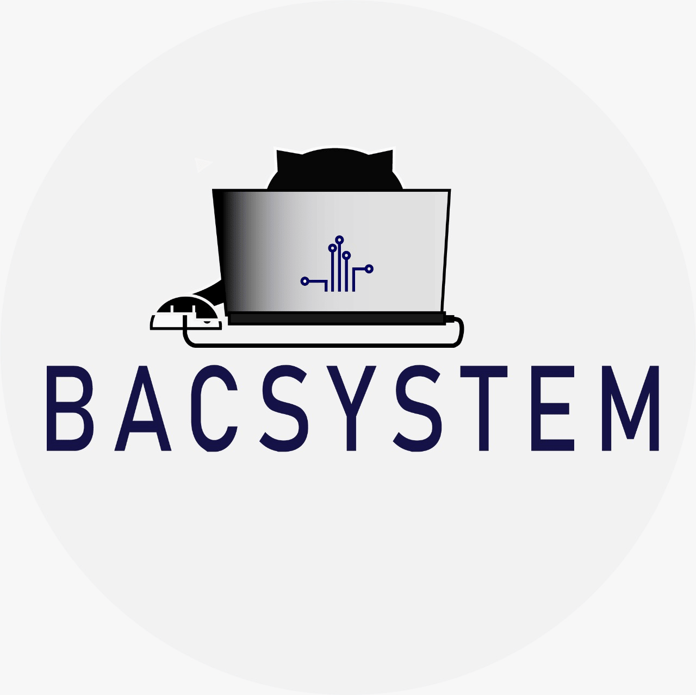

<p align="center">
    <a >
        
    </a>
    <a href="http://nestjs.com/" target="blank">
        
    </a>
</p>

<div align="center">

<a href=""></a>
<a href=""></a>
<a href=""></a>
<a href=""></a>
<a href=""></a>
<a href=""></a>
<a href=""></a>
<a href=""></a>
<a href="">
</a>
</div>

<div align="center">

<a href=""></a>
<a href=""></a>
<a href=""></a>
<a href=""></a>
<a href=""></a>
</div>

## Description

[Node-Nest](https://github.com/dbacilio88/node-nest) Application TypeScript starter repository.

## Installation

```bash
$ npm install
```

## Running the app

```bash
# development
$ npm run start

# watch mode
$ npm run start:dev

# production mode
$ npm run start:prod
```

## Test

```bash
# unit tests
$ npm run test

# e2e tests
$ npm run test:e2e

# test coverage
$ npm run test:cov
```

## Dev docker

```bash
# image docker build
$ docker compose -f docker-compose.dev.yml build 

# docker run container
$  docker compose -f docker-compose.dev.yml up 
$  docker compose -f docker-compose.dev.yml up -d

# docker stop and remove container, volumes
docker compose -f docker-compose.dev.yml down --volumes


```

## Prod docker

```bash
# image docker build
$ docker compose -f docker-compose.dev.yml build 

# docker run container
$  docker compose -f docker-compose.dev.yml up 
$  docker compose -f docker-compose.dev.yml up -d

# docker stop and remove container, volumes
docker compose -f docker-compose.dev.yml down --volumes
```

## Run docker container after Prod docker

```bash
# docker run container
$  docker compose up 
$  docker compose up -d

# docker stop and remove container, volumes
docker compose down --volumes
```


### MarkDown

https://www.markdownguide.org/basic-syntax/

## Stay in touch

- Author - [Christian bacilio](https://github.com/dbacilio88)

## License

Nest is [MIT licensed](LICENSE).
